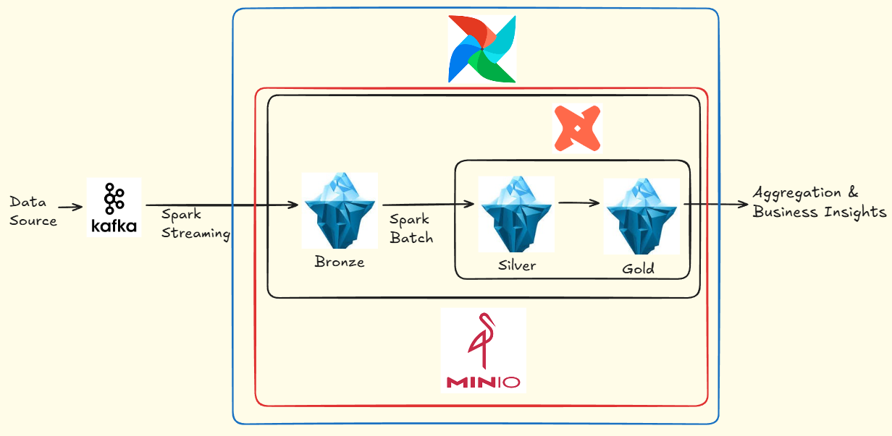

# Data Pipeline for GitHub Events

Dự án này triển khai một Data Pipeline toàn diện (End-to-End), được thiết kể để xử lý dữ liệu sự kiện thời gian thực từ GitHub, sử dụng kiến trúc Lakehouse hiện đại.

## 🛠 Tech Stack
*   **Ingestion**: FastAPI & Kafka
*   **Orchestration**: [Apache Airflow](https://airflow.apache.org/)
*   **Processing Engine**: [Apache Spark](https://spark.apache.org/) (Streaming & Batch)
*   **Table Format**: [Apache Iceberg](https://iceberg.apache.org/)
*   **Transformation**: [dbt](https://www.getdbt.com/)
*   **Storage**: [MinIO](https://min.io/) (S3 Compatible)
*   **Infrastructure**: Docker & Docker Compose

## 📂 Project Structure
- `airflow/`: Cấu hình Docker build và Plugins cho Airflow.
- `dags/`: Chứa các pipeline điều phối (DAGs) và code Spark.
- `dbt_project/`: Project dbt quản lý logic transform dữ liệu (Silver -> Gold).
- `metric_collector/`: Service API nhận dữ liệu và Kafka Producer.
- `docker-compose.yaml`: Định nghĩa toàn bộ hạ tầng (Infrastructure as Code).

## 🏗 Kiến trúc hệ thống (Architecture)
Hệ thống sử dụng kiến trúc **Lambda Architecture** giản lược, kết hợp giữa Streaming (Ingestion) và Batch (Processing).

### Detailed Pipeline Flow

**1. Ingestion Layer: API & Kafka (High Throughput & Reliability)**
*   **API Gateway**: Thiết kế theo hướng **Non-blocking I/O** & **Fail-Fast**.
    *   Nhận payload JSON -> Gán Trace ID (`event_id`) -> Đẩy vào Memory Queue (`put_nowait`).
    *   Phản hồi client tức thì với độ trễ cực thấp (<10ms).
    *   Cơ chế **Backpressure**: Trả về `503 Service Unavailable` khi hàng đợi đầy để bảo vệ tài nguyên server.
*   **Producer Worker**:
    *   **Hybrid Batching Strategy**: Tự động chuyển đổi giữa 'Polling' (High Load) và 'Waiting' (Low Latency) để tối ưu throughput.
    *   **Non-blocking Serialization**: Dùng `run_in_executor` để đẩy tác vụ nén Avro (CPU-bound) sang thread riêng, giữ cho Event Loop luôn mượt mà.
    *   **Data Durability**: Cơ chế Retry kết hợp **Local Fallback** giúp đảm bảo không mất mát dữ liệu (Zero Data Loss) kể cả khi Kafka gặp sự cố.

**2. Bronze Layer: Streaming Ingestion (Kafka -> Iceberg)**
*   Spark Structured Streaming đọc liên tục từ Kafka topic.
*   Sử dụng **UDF Decoder** giải mã Avro binary ngay trong Spark.
*   **Flattening**: Làm phẳng cấu trúc JSON lồng nhau.
*   Ghi vào bảng Iceberg `demo.bronze.github_events` với chế độ Fanout Writer.

**3. Silver Layer (Part 1): Raw to Structured (Spark Batch)**
*   Trigger bởi Airflow định kỳ (Hourly).
*   **Incremental Load**: Chỉ đọc dữ liệu mới từ Bronze dựa vào watermark `ingestion_timestamp`.
*   **Parsing**: Parse cột `payload` JSON thành các cột quan trọng (PR details, Issue state...).
*   **Upsert**: Sử dụng `MERGE INTO` để deduplicate dữ liệu.

**4. Silver Layer (Part 2): Structured to Enriched (dbt)**
*   Làm sạch dữ liệu, chuẩn hóa định dạng chuỗi.
*   **Event Categorization**: Phân loại sự kiện (Code Change, Social, Management...).
*   Tính toán Activity Score cho từng event.

**5. Gold Layer: Aggregation & Business Insights (dbt)**
*   **Daily Aggregation**: Tổng hợp hoạt động người dùng theo ngày.
*   **User Profiling**: Phân loại User (Developer, Reviewer, etc.) dựa trên hành vi đóng góp.
*   Tính toán các chỉ số xu hướng (Rolling Average).

**6. Orchestration**
*   **Airflow DAG** chạy định kỳ mỗi giờ:
    1.  `Spark Job`: Bronze -> Silver Parsed.
    2.  `dbt run`: Silver Enriched update.
    3.  `dbt run`: Gold User Activity update.
    4.  `dbt test`: Kiểm tra chất lượng dữ liệu (Unique ID, Not Null...).

**7. Maintenance Layer (Iceberg Table Optimization)**
Hệ thống Iceberg cần được bảo trì định kỳ để giải quyết vấn đề "Small Files" do quá trình Streaming sinh ra liên tục.
*   **Daily Job**: ([af_maintenance_bronze_by_day.py])
    *   Thực hiện **Rewrite Data Files (Compaction)** sử dụng chiến thuật Bin-pack.
    *   Gom hàng ngàn file nhỏ (KB) thành các file tiêu chuẩn (~20MB) để tăng tốc độ đọc cho Spark/dbt.
*   **Weekly Job**: ([af_maintenance_bronze_by_week.py])
    *   **Expire Snapshots**: Xóa các version dữ liệu cũ (Time Travel) không còn cần thiết.
    *   **Cleanup**: Xóa bỏ các file rác (Orphan files) và Manifest cũ để giải phóng dung lượng Storage.

## 🚀 Getting Started

### 1. Prerequisites
- Docker & Docker Compose installed.
- RAM tối thiểu: 6-8GB.

### 2. Setup Environment
Tạo file [.env] tại thư mục gốc và cấu hình các thông số kết nối (tham khảo file `docker-compose.yaml`):
